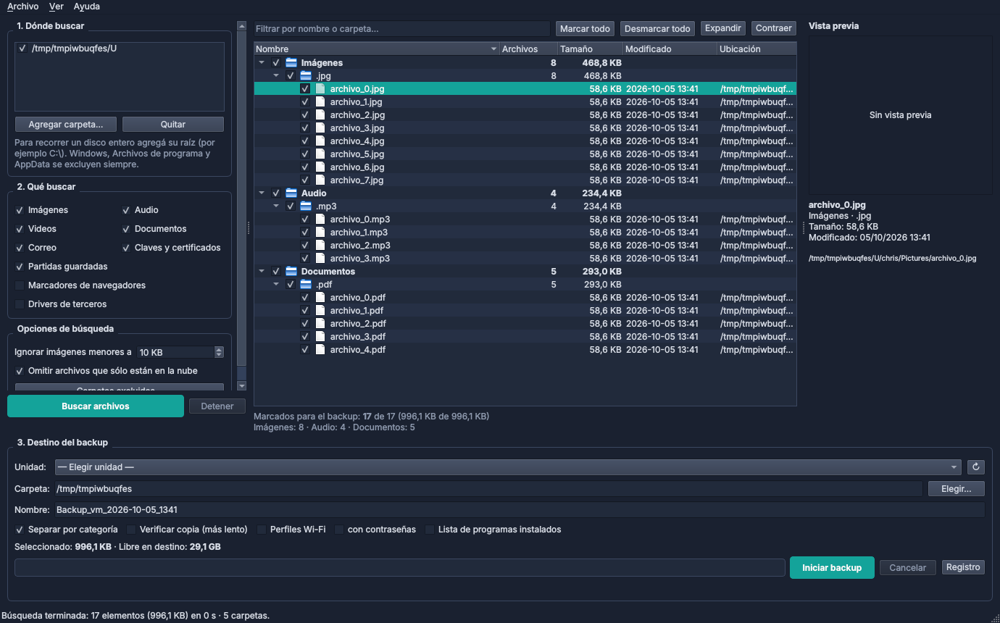

# BackupTool

Aplicación de escritorio para Windows (Python + PySide6) que busca y respalda en un disco externo o pendrive lo importante de una PC:

- **Archivos personales**: imágenes, audio, videos, documentos, correo (.pst, .eml…), claves y certificados (KeePass, .pfx…) y partidas guardadas de juegos.
- **Marcadores** de Chrome, Edge, Brave, Vivaldi, Opera y Firefox, de todos los usuarios. Se copia el archivo original y además se exporta a `marcadores.html`, que cualquier navegador puede importar.
- **Drivers de terceros**, exportados con `pnputil`.
- **Perfiles Wi-Fi** y **lista de programas instalados**, para saber qué reinstalar.

Los resultados se muestran en un explorador agrupado por **categoría → extensión**, con filtro de texto, ordenamiento por columna, vista previa de imágenes y casillas para elegir qué copiar.



## Temas

En **Ver → Tema** se elige entre *Según Windows*, *Claro*, *Oscuro*, *Medianoche* y *Arena*. La elección se recuerda para la próxima vez.

Para agregar un tema nuevo alcanza con sumar una entrada a `THEMES` en `backuptool/ui/themes.py`.

## Requisitos

- Windows 10 u 11
- Python 3.10 o superior

```bat
pip install -r requirements.txt
python main.py
```

## Permisos de administrador

La búsqueda y la copia de archivos funcionan como usuario común. Para exportar **drivers** y las **contraseñas Wi-Fi** hace falta ejecutar la app como administrador. La app avisa con una franja amarilla y tiene un botón para reiniciarse con permisos elevados.

## Generar el .exe

```bat
build.bat
```

Genera `dist\BackupTool\BackupTool.exe` con PyInstaller. El ejecutable pide permisos de administrador al abrirse (`--uac-admin`).

## Cómo se usa

1. **Dónde buscar**: por defecto se recorre `C:\Users` (los perfiles de usuario). También se pueden tildar otras unidades o agregar cualquier carpeta; para un disco entero, agregar su raíz (`C:\`).
2. **Qué buscar**: se tildan las categorías y se presiona **Buscar archivos**. Los resultados aparecen en el explorador mientras se recorre el disco.
3. En el explorador se desmarca lo que no se quiera copiar. Doble clic abre el archivo; clic derecho permite **Mostrar en el Explorador**.
4. **Destino**: se elige la unidad (los pendrives aparecen primero) o una carpeta, y se presiona **Iniciar backup**. Antes de empezar, la app verifica el espacio libre, avisa si el destino es FAT32 (no admite archivos de 4 GB o más) y si el destino está en el mismo disco del sistema.

### Qué se excluye siempre

`Windows`, `Program Files`, `ProgramData`, `AppData`, la Papelera, `System Volume Information` y carpetas de desarrollo como `node_modules`, `.git` o `venv`. La lista se puede editar con **Carpetas excluidas…**.

AppData se excluye porque está llena de cachés. Los marcadores de los navegadores, que viven ahí, se buscan aparte por su ruta conocida.

## Estructura del backup

```
Backup_<PC>_<fecha>/
├── Imágenes/C/Users/chris/Pictures/...   ← se respeta la ruta original
├── Audio/ ...  Videos/ ...  Documentos/ ...
├── Marcadores/<navegador>/<usuario>/<perfil>/marcadores.html
├── Drivers/oemNN/ ... + drivers.csv + LEEME.txt
├── Sistema/WiFi/*.xml + Sistema/programas_instalados.csv
├── manifiesto.csv   ← origen, destino, tamaño y estado de cada elemento
├── errores.log      ← sólo si hubo errores
└── LEEME.txt        ← resumen
```

Si se repite el backup con **el mismo nombre** en el mismo destino, los archivos que ya están (con igual tamaño y fecha) se saltean. Así se puede retomar un backup cortado o actualizar uno anterior.

## Restaurar

| Qué | Cómo |
|---|---|
| Archivos | Copiarlos desde la carpeta de su categoría |
| Marcadores | En el navegador: *Importar marcadores* → `marcadores.html` |
| Drivers | Consola como administrador en `Drivers\`: `pnputil /add-driver "*.inf" /subdirs /install` |
| Wi-Fi | `netsh wlan add profile filename="archivo.xml" user=all` |

## Estructura del código

```
main.py                     punto de entrada
backuptool/core/            lógica, sin dependencias de Qt (se prueba sin interfaz)
    categories.py           categorías, extensiones y exclusiones
    scanner.py              recorrido con os.scandir (pila, sin recursión, cancelable)
    browsers.py             lectura de marcadores Chromium/Firefox y exportación HTML
    drivers.py              listado de oem*.inf y exportación con pnputil
    extras.py               perfiles Wi-Fi y programas instalados (registro)
    copier.py               copia por bloques con progreso, reanudación, verificación SHA-256
    winutils.py             unidades, permisos, rutas largas, comandos de consola
backuptool/ui/
    main_window.py          ventana principal
    file_model.py           modelo de árbol propio (QAbstractItemModel) + proxy de filtro
    workers.py              búsqueda y copia en QThread
    themes.py               temas (paleta + hoja de estilos) e ícono
backuptool/resources/       icon.png e icon.ico
tools/make_icon.py          regenera el ícono (dibujado con QPainter; el .ico usa Pillow)
tests/                      pytest (núcleo + prueba de humo de la interfaz)
```

Para correr las pruebas:

```bat
pip install pytest
python -m pytest
```

## Limitaciones conocidas

- Un archivo abierto en otro programa (por ejemplo un `.pst` con Outlook abierto) puede fallar; queda registrado en `errores.log`. Conviene cerrar Outlook antes del backup.
- Los archivos de OneDrive que están sólo en la nube se omiten (opción configurable), porque leerlos obligaría a descargarlos.
- No respalda perfiles completos de Thunderbird, configuraciones de programas ni el registro de Windows.
- Para ver los perfiles de otros usuarios de la PC hay que ejecutar como administrador.

## Licencia

MIT — ver [LICENSE](LICENSE).
